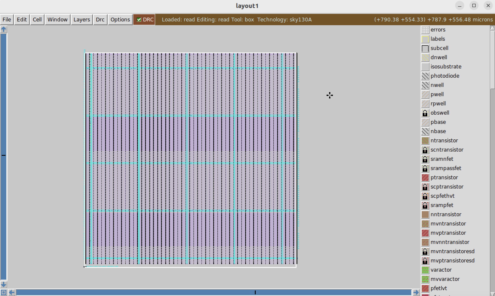
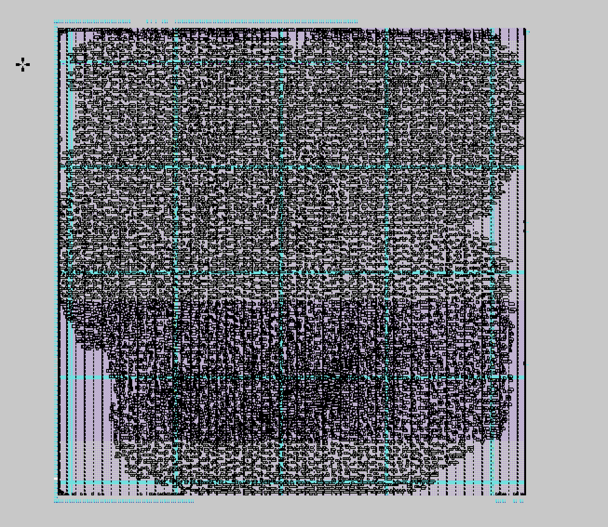
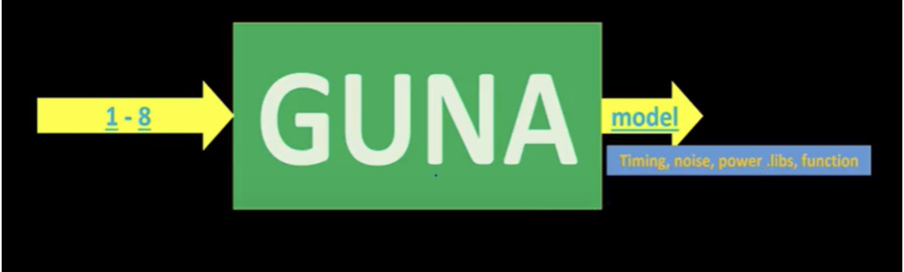
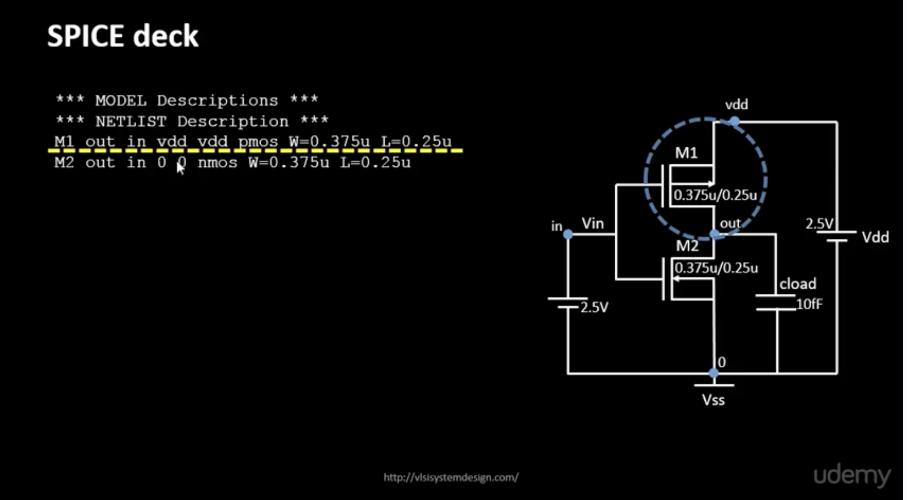
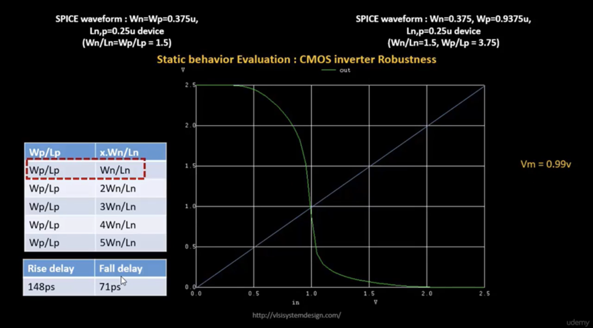
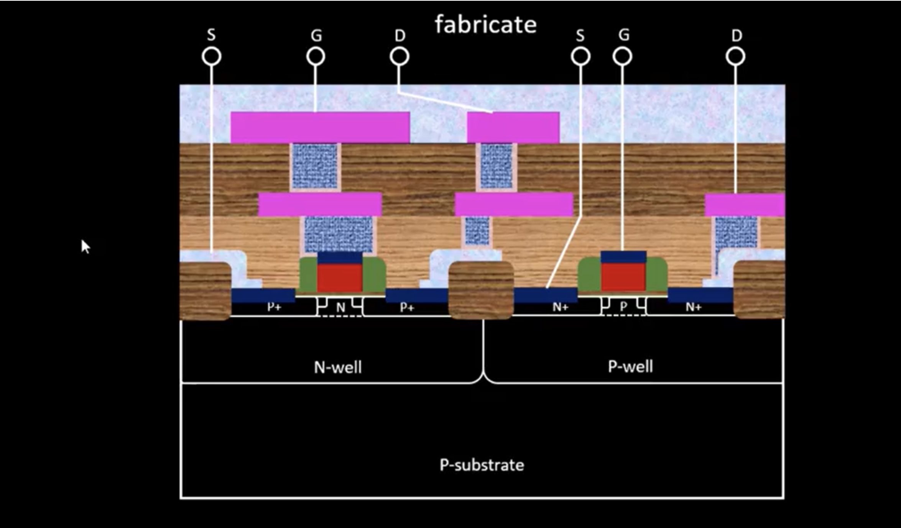
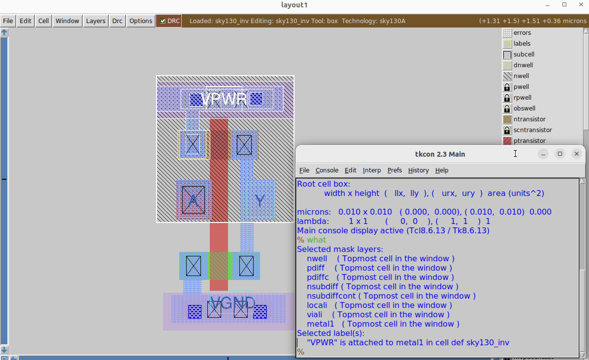

# NASSCOM &VSD -PHYSICAL DESIGN USING OPENLANE

## Table of Contents
- [Day - 1 Inception of Open-Source EDA, OpenLane and Sky130 PDK](#day---1-inception-of-open-source-eda-openlane-and-sky130-pdk)
- [Day - 2 Good Floor plan Vs Bad floor plan](#day---2-good-floorplan-vs-bad-floorplan-and-introduction-to-library-cells)
- [Day - 3 Design Library Cells using magic](#day--3-design-library-cell-using-magic-layout-and-ngspice-charcterization)
- [Day - 4 Timing Analysis and Clock Tree Synthesis](#day-4-timing-analysis-and-clock-tree-synthesis-cts)
- [Day - 5 Final Steps in RTL2GDS](#day-5--final-steps-in-rtl2gds)
- [Acknowledgement](#acknowledgement)
- [References](#references)

## Day - 1 Inception of Open-Source EDA, OpenLane and Sky130 PDK
### Introduction to RISC-V
RISC-V is an open-source instruction set architecture (ISA) that is adopted in the world of computer architecture and processor design. It was originally developed at the University of California, Berkeley in 2010 and has since grown into a global collaboration of researchers and industry experts. The key characteristic of RISC-V is its simplicity and modularity. It follows the Reduced Instruction Set Computer (RISC) design philosophy, which emphasizes a small and streamlined set of instructions that are easy to decode and execute. RISC-V offers a base set of instructions, called the "RV32I," which provides essential operations for general-purpose computing. Additional optional instruction sets, such as RV32F for single-precision floating-point operations or RV64G for 64-bit computing, can be added to meet specific application requirements. One of the major advantages of RISC-V is its open nature. The ISA specifications, reference implementations, and software tools are freely available, allowing anyone to study, modify, or implement their own RISC-V processors without licensing fees or restrictions. This openness has fostered a vibrant ecosystem of hardware designers, software developers, and researchers who collaborate and innovate around the RISC-V architecture.

### How the software applications run on the hardware ?
All the software applications we use in our daily lives rely on hardware to run. The system software is responsible for translating the application program into binary language, which the hardware can understand and execute. The primary components of system software include the Operating System (OS), Compiler, and Assembler. The OS plays a crucial role in managing various aspects of the computer system. It provides an environment for the application program to run and handles tasks such as memory management, process scheduling, and input/output operations. Depending on the underlying architecture, such as MIPS, x86, x64, or RISC-V, the OS translates the application program into assembly language instructions. The compiler is responsible for converting high-level programming languages, like C or Java, into assembly-level language instructions. This translation process is influenced by the specific architecture on which the software will be executed. Different architectures have their own instruction sets, and the compiler ensures that the instructions generated are compatible with the targeted architecture. Once the code is in assembly language, the assembler comes into play. It takes the assembly code and translates it into binary code, which is a sequence of 0s and 1s that can be directly dumped into the hardware.


**RTL IPs**, or Register Transfer Level Intellectual Property, refer to pre-designed and pre-verified digital hardware components or blocks that are described at the Register Transfer Level (RTL). RTL is a hardware description language (HDL) representation of a digital circuit or a portion of a circuit. In the context of integrated circuit (IC) design, an IP refers to a reusable building block that can be integrated into a larger design. RTL IPs, specifically, are designed at the register transfer level, which represents the flow of data between registers and the operations performed on that data.These IPs can be licensed from IP vendors or developed in-house. They provide a level of abstraction that allows designers to focus on higher-level design aspects rather than implementing low-level details from scratch. RTL IPs offer various advantages, such as improved productivity, faster time-to-market, and increased design reliability. By using RTL IPs, designers can leverage optimized and well-tested building blocks, reducing the likelihood of errors and bugs. Additionally, using RTL IPs promotes design reuse, enabling designers to create complex systems by assembling and integrating different IP blocks.

**EDA (Electronic Design Automation) tools** are software applications used in the design, development, and analysis of electronic systems, including integrated circuits (ICs), printed circuit boards (PCBs), and other electronic components. These tools automate various tasks involved in the design process, increasing efficiency and reducing time-to-market.

**Process Design Kit (PDK)** is a set of files used within the semiconductor industry to model a fabrication process for the design tools used to design an integrated circuit.  PDK’s are often specific to a foundry, and may be subject to a non-disclosure agreement.  While most PDK’s are proprietary to a foundry, certain PDKs are opensource and entirely within the public domain.Traditionally, PDKs have been proprietary and provided by semiconductor foundries, limiting access and customization options for IC designers. However, open-source PDKs aim to promote collaboration, innovation, and accessibility by making the design kit freely available to the community. By providing an open-source PDK, designers can modify and customize the kit to suit their specific requirements. This flexibility allows for greater innovation, collaboration, and knowledge sharing within the design community. It also lowers the barriers to entry for new designers and encourages participation in the development of new ICs and electronic systems. Some of the  open-source PDKs are : SKY130, GFU180, ASAP7 etc

### Simplified RTL to GDSII flow 
The RTL to GDSII flow basically involves :
1. **RTL Design** -  The process begins with the RTL design phase, where the digital circuit is described using a hardware description language (HDL) like VHDL or Verilog. The RTL description captures the functional behavior of the circuit, specifying its logic and data paths.

2. **RTL Synthesis** - RTL synthesis converts the high-level RTL description into a gate-level netlist. This stage involves mapping the RTL code to a library of standard cells (pre-designed logic elements) and optimizing the resulting gate-level representation for area, power, and timing. The output of RTL synthesis is typically in a format called the gate-level netlist.

3. **Floor and Power Planning** - is a crucial step in the digital design flow that involves partitioning the chip's area and determining the placement of major components and functional blocks. It establishes an initial high-level layout and defines the overall chip dimensions, locations of critical modules, power grid distribution, and I/O placement.The primary goals of floor planning are: Area Partitioning, Power Distribution, Signal Flow and Interconnect Planning, Placement of Key Components, Design Constraints and Optimization.

4. **Placement** - Placement involves assigning the physical coordinates to each gate-level cell on the chip's layout. The placement process aims to minimize wirelength, optimize signal delay, and satisfy design rules and constraints. Modern placement algorithms use techniques like global placement and detailed placement to achieve an optimal placement solution.

5. **Clock Tree Synthesis** - Clock tree synthesis (CTS) is a crucial step in the digital design flow that involves constructing an optimized clock distribution network within an integrated circuit (IC). The primary goal of CTS is to ensure balanced and efficient clock signal distribution to all sequential elements (flip-flops, registers) within the design, minimizing clock skew and achieving timing closure.

6. **Routing** - Routing connects the gates and interconnects on the chip based on the placement information. It involves determining the optimal paths for the wires and vias that carry signals between different components. The routing process needs to adhere to design rules, avoid congestion, and optimize for factors like signal integrity, power, and manufacturability.

7. **Sign-off** - Sign-off analysis refers to the final stage of the electronic design process, where comprehensive verification and analysis are performed to ensure that the design meets all the necessary requirements and specifications. It involves a series of checks and simulations to confirm that the design is ready for fabrication and meets the desired functionality, performance, power, and reliability targets. 

8. **GDSII File Generation** - Once the layout is verified and passes all checks, the final step is to generate the GDSII file format, which represents the complete physical layout of the chip. The GDSII file contains the geometric information necessary for fabrication, including the shapes, layers, masks, and other relevant details.

### Introduction to OpenLANE
OpenLane is an automated RTL to GDSII flow based on several components including OpenROAD, Yosys, Magic, Netgen, CVC, SPEF-Extractor, KLayout and a number of custom scripts for design exploration and optimization. It also provides a number of custom scripts for design exploration and optimization. The flow performs all ASIC implementation steps from RTL all the way down to GDSII. Currently, it supports both A and B variants of the sky130 PDK, the C variant of the gf180mcu PDK, and instructions to add support for other (including proprietary) PDKs are documented. The whole documentation can be found here [https://github.com/The-OpenROAD-Project/OpenLane].
OpenLane abstracts the underlying open source utilities, and allows users to configure all their behavior with just a single configuration file.


# OpenLane Architecture


## OpenLane Design Stages

OpenLane flow consists of several stages. By default all flow steps are run in sequence. Each stage may consist of multiple sub-stages. OpenLane can also be run interactively as shown [here][25].

1. **Synthesis**
    1. `yosys/abc` - Perform RTL synthesis and technology mapping.
    2. `OpenSTA` - Performs static timing analysis on the resulting netlist to generate timing reports
2. **Floorplaning**
    1. `init_fp` - Defines the core area for the macro as well as the rows (used for placement) and the tracks (used for routing)
    2. `ioplacer` - Places the macro input and output ports
    3. `pdngen` - Generates the power distribution network
    4. `tapcell` - Inserts welltap and decap cells in the floorplan
3. **Placement**
    1. `RePLace` - Performs global placement
    2. `Resizer` - Performs optional optimizations on the design
    3. `OpenDP` - Performs detailed placement to legalize the globally placed components
4. **CTS**
    1. `TritonCTS` - Synthesizes the clock distribution network (the clock tree)
5. **Routing**
    1. `FastRoute` - Performs global routing to generate a guide file for the detailed router
    2. `TritonRoute` - Performs detailed routing
    3. `OpenRCX` - Performs SPEF extraction
6. **Tapeout**
    1. `Magic` - Streams out the final GDSII layout file from the routed def
    2. `KLayout` - Streams out the final GDSII layout file from the routed def as a back-up
7. **Signoff**
    1. `Magic` - Performs DRC Checks & Antenna Checks
    2. `KLayout` - Performs DRC Checks
    3. `Netgen` - Performs LVS Checks
    4. `CVC` - Performs Circuit Validity Checks

OpenLane integrated several key open source tools over the execution stages:
- RTL Synthesis, Technology Mapping, and Formal Verification : [yosys + abc][4]
- Static Timing Analysis: [OpenSTA][8]
- Floor Planning: [init_fp][5], [ioPlacer][6], [pdn][16] and [tapcell][7]
- Placement: [RePLace][9] (Global), [Resizer][15] and [OpenPhySyn][28] (formerly), and [OpenDP][10] (Detailed)
- Clock Tree Synthesis: [TritonCTS][11]
- Fill Insertion: [OpenDP/filler_placement][10]
- Routing: [FastRoute][12] or [CU-GR][36] (formerly) and [TritonRoute][13] (Detailed) or [DR-CU][36]
- SPEF Extraction: [OpenRCX][37] or [SPEF-Extractor][27] (formerly)
- GDSII Streaming out: [Magic][14] and [KLayout][35]
- DRC Checks: [Magic][14] and [KLayout][35]
- LVS check: [Netgen][22]
- Antenna Checks: [Magic][14]
- Circuit Validity Checker: [CVC][31]

> Everything in Floorplanning through Routing is done using [OpenROAD](https://github.com/The-OpenROAD-Project/OpenROAD) and its various sub-utilities.

## OpenLane Output

All output run data is placed by default under ./designs/design_name/runs. Each flow cycle will output a timestamp-marked folder containing the following file structure:

```
<design_name>
├── config.json/config.tcl
├── runs
│   ├── <tag>
│   │   ├── config.tcl
│   │   ├── {logs, reports, tmp}
│   │   │   ├── cts
│   │   │   ├── signoff
│   │   │   ├── floorplan
│   │   │   ├── placement
│   │   │   ├── routing
│   │   │   └── synthesis
│   │   ├── results
│   │   │   ├── final
│   │   │   ├── cts
│   │   │   ├── signoff
│   │   │   ├── floorplan
│   │   │   ├── placement
│   │   │   ├── routing
│   │   │   └── synthesis
```

To delete all generated runs under all designs:
`make clean_runs`

## Installation for MacOS (Apple Chip M1,M2,M3)
So far all we did was to learn about the flow and it's working. The workshop has contents tailored to Intel based chips and also Ubuntu, since most of the softwares haven't been updated to work with Apple's Chip, we have to do some run-around. First, the workshop works based on virtualbox and virtual machine, since VirtualBox hasn't released a stable version yet, we would have to use UTM for MacOS. And the disk-image wouldn't be compatible with UTM. So you need to have the unaltered picorv32a files, which can be found in the repository [here][40]

### Installation of Ubuntu using UTM
For the installation and use of Ubuntu as a Virtual Machine in MacOS, I followed this [video][2]. Once installed while rebooting if you do not get this 

 

do not panic just shut down the VM and follow the next steps.
Now you have ubuntu in a VM, the next step is to download and install openlane and docker.

### OpenLane Installation
Prior to the installation of the OpenLane install the dependencies and packages using the command shown below :</br>
``` 
sudo apt-get update
sudo apt-get upgrade
sudo apt install -y build-essential python3 python3-venv python3-pip make git

Docker Installation for Openlane
```
Docker Installation :</br>
```
sudo apt install apt-transport-https ca-certificates curl software-properties-common
curl -fsSL https://download.docker.com/linux/ubuntu/gpg | sudo gpg --dearmor -o /usr/share/keyrings/docker-archive-keyring.gpg

echo "deb [arch=amd64 signed-by=/usr/share/keyrings/docker-archive-keyring.gpg] https://download.docker.com/linux/ubuntu $(lsb_release -cs) stable" | sudo tee /etc/apt/sources.list.d/docker.list > /dev/null

sudo apt update
sudo apt install docker-ce docker-ce-cli containerd.io
sudo docker run hello-world

sudo groupadd docker
sudo usermod -aG docker $USER
sudo reboot 


# Check for successful installation
sudo docker run hello-world 
```
Once you run the above docker run, if you have installed it properly then the screen will appear like this.


**Steps to install OpenLane, PDKs and Tools**</br>
```
cd $HOME
git clone https://github.com/The-OpenROAD-Project/OpenLane --recurse-submodules 
cd OpenLane
make
make test
cd /home/anupriyavsd/OpenLane/designs/ci
cp -r * ../
```
After a successful ```make``` when you run ```make test``` you will have a ```Basic test passed``` on your terminal. At this step when openlane is running, include the [picorv32a][40]
In order to start open lane and run synthesis we would follow the next steps.

### Steps to run synthesis in OpenLane Interactive mode:


```
cd ~/OpenLane
make mount
./flow.tcl -interactive
package require openlane 0.9
prep -design picorv32a
run_synthesis
```

To view nelist
```
cd /home/anupriyavsd/OpenLane/designs/picorv32a/runs/RUN_2024.05.20_09.42.05/results/synthesis
vim picorv32a.v
```


To view the report:
```
cd /home/anupriyavsd/OpenLane/designs/picorv32a/runs/RUN_2024.05.20_09.42.05/reports/synthesis
vim 1-synthesis.AREA_0.stat.rpt

63. Printing statistics.

=== picorv32a ===

   Number of wires:              16278
   Number of wire bits:          16660
   Number of public wires:        1475
   Number of public wire bits:    1857
   Number of memories:               0
   Number of memory bits:            0
   Number of processes:              0
   Number of cells:              16558

  sky130_fd_sc_hd__a2111o_2      22
  sky130_fd_sc_hd__a211o_2      256
  sky130_fd_sc_hd__a211oi_2     138
  sky130_fd_sc_hd__a21bo_2      134
  sky130_fd_sc_hd__a21boi_2      39
  sky130_fd_sc_hd__a21o_2       445
  sky130_fd_sc_hd__a21oi_2      550
  sky130_fd_sc_hd__a221o_2      183
  sky130_fd_sc_hd__a221oi_2       7
  sky130_fd_sc_hd__a22o_2       388
  sky130_fd_sc_hd__a22oi_2      221
  sky130_fd_sc_hd__a2bb2o_2      27
  sky130_fd_sc_hd__a311o_2       15
  sky130_fd_sc_hd__a311oi_2       1
  sky130_fd_sc_hd__a31o_2       223
  sky130_fd_sc_hd__a31oi_2        4
  sky130_fd_sc_hd__a32o_2        57
  sky130_fd_sc_hd__a32oi_2        1
  sky130_fd_sc_hd__a41o_2         1
  sky130_fd_sc_hd__and2_2       361
  sky130_fd_sc_hd__and2b_2      288
  sky130_fd_sc_hd__and3_2       340
  sky130_fd_sc_hd__and3b_2       57
  sky130_fd_sc_hd__and4_2       296
  sky130_fd_sc_hd__and4b_2        7
  sky130_fd_sc_hd__and4bb_2      26
  sky130_fd_sc_hd__buf_1       2996
  sky130_fd_sc_hd__buf_2          8
  sky130_fd_sc_hd__conb_1        41
  sky130_fd_sc_hd__dfxtp_2     1613
  sky130_fd_sc_hd__inv_2        187
  sky130_fd_sc_hd__mux2_2      1479
  sky130_fd_sc_hd__mux4_2        33
  sky130_fd_sc_hd__nand2_2      946
  sky130_fd_sc_hd__nand2b_2       3
  sky130_fd_sc_hd__nand3_2      175
  sky130_fd_sc_hd__nand3b_2      27
  sky130_fd_sc_hd__nand4_2       88
  sky130_fd_sc_hd__nand4b_2       1
  sky130_fd_sc_hd__nor2_2       853
  sky130_fd_sc_hd__nor3_2        80
  sky130_fd_sc_hd__nor3b_2        7
  sky130_fd_sc_hd__nor4_2        24
  sky130_fd_sc_hd__o2111a_2       3
  sky130_fd_sc_hd__o2111ai_2      2
  sky130_fd_sc_hd__o211a_2      328
  sky130_fd_sc_hd__o211ai_2      73
  sky130_fd_sc_hd__o21a_2       273
  sky130_fd_sc_hd__o21ai_2      280
  sky130_fd_sc_hd__o21ba_2      168
  sky130_fd_sc_hd__o21bai_2      44
  sky130_fd_sc_hd__o221a_2       40
  sky130_fd_sc_hd__o221ai_2       2
  sky130_fd_sc_hd__o22a_2        96
  sky130_fd_sc_hd__o22ai_2        5
  sky130_fd_sc_hd__o2bb2a_2      28
  sky130_fd_sc_hd__o2bb2ai_2      2
  sky130_fd_sc_hd__o311a_2       38
  sky130_fd_sc_hd__o311ai_2       2
  sky130_fd_sc_hd__o31a_2        15
  sky130_fd_sc_hd__o31ai_2        7
  sky130_fd_sc_hd__o32a_2        15
  sky130_fd_sc_hd__o32ai_2        1
  sky130_fd_sc_hd__o41a_2         2
  sky130_fd_sc_hd__o41ai_2        1
  sky130_fd_sc_hd__or2_2        587
  sky130_fd_sc_hd__or2b_2       200
  sky130_fd_sc_hd__or3_2        194
  sky130_fd_sc_hd__or3b_2        38
  sky130_fd_sc_hd__or4_2         72
  sky130_fd_sc_hd__or4b_2        17
  sky130_fd_sc_hd__or4bb_2       15
  sky130_fd_sc_hd__xnor2_2     1055
  sky130_fd_sc_hd__xor2_2       307

   Chip area for module '\picorv32a': 162661.004800


```


```
Flop ratio = Number of D Flip flops = 1613  = 0.097415 or 9.7415%
             ______________________   _____
             Total Number of cells    16558
```


## Day - 2 Good Floorplan Vs Bad Floorplan and Introduction to Library Cells
### Utilization factor and Aspect ratio


```
Utilization Factor = Area occupied by netlist
                     -------------------------
                      Total area of the core 
```


```
Aspect Ratio = Height of Core
              ----------------
               Width of Core
```
When the aspect ratio is 1, the chip is squared in shape.

### Preplaced Cells

The pre-placed cells are typically larger and more complex modules, such as memory blocks, complex functional units, or other predefined structures that are designed separately and then positioned in the layout before the placement and routing stages. Pre-placed cells are often used for several reasons:Performance optimization, IP integration and Power optimization. The preplaced cells are reused in the designs.These pre-placed cells should be surrounded by de-coupling capacitors. Decoupling capacitors are large capacitors that store electrical charge. They have a voltage across them similar to that of the power supply. When a circuit switches, the decoupling capacitor acts as a power source for the circuit, effectively isolating it from the main power supply. During switching events, the decoupling capacitor supplies the necessary current to the circuit. To minimize voltage drops, these capacitors are positioned in close proximity to the circuit. They ensure that the circuit receives the required current during switching operations. The purpose of the decoupling capacitor is to charge the circuit. When a switching activity occurs, the decoupling capacitor transfers some of its charge to the circuit. During periods of no switching activity, the decoupling capacitor replenishes its charge from the power supply.

### Decoupling Capacitor
Decoupling capacitors constitute an indispensable element within the realm of electronic circuit design, particularly in the context of integrated circuits (ICs) and printed circuit boards (PCBs). Their primary purpose revolves around the stabilization of power supply voltage levels, a crucial function in mitigating noise and upholding consistent voltage for delicate components. As electronic apparatuses operate at elevated frequencies, abrupt shifts in current demands can incite voltage fluctuations and unwanted noise, thereby resulting in performance dilemmas and signal deterioration. Decoupling capacitors, akin to a safeguard, establish a local storehouse of electrical charge that can swiftly respond to these fluctuations. Essentially, they act as reservoirs, storing and disbursing electrical energy as required, effectively sieving out undesirable noise and voltage oscillations. 

Decoupling capacitors are strategically sited in close proximity to power-thirsty constituents, such as microprocessors, digital logic circuits, or high-speed memory modules, where they adeptly soak up and provide instant current requisites. Through curbing voltage fluctuations, they heighten the overall fidelity of signals and prevent potential issues like ground disturbance, signal interference, and electromagnetic perturbations. The physical configuration of decoupling capacitors necessitates judiciously determining the appropriate capacitance magnitude, voltage rating, and package dimensions based on the distinct requisites of the circuit. The capacitance value must adequately meet current necessities and the frequency spectrum of the circuit. Greater capacitance values promise superior noise suppression but can introduce bulkier physical dimensions and cost ramifications. Furthermore, the placement of decoupling capacitors assumes paramount importance, requiring them to be positioned as proximate as feasible to the power and ground pins of the targeted components, thereby minimizing inductance and resistance along the supply path. This close proximity ensures efficient energy transmission between the power source and the components, concurrently diminishing impedance and maximizing the capacitor's efficacy.

### Power Planning

Power planning in integrated circuit (IC) design involves the careful consideration and distribution of power and ground connections to ensure proper functionality and performance of the chip. One important aspect of power planning is the placement of multiple ground (GND) and supply voltage (VDD) points throughout the IC layout.The need for multiple GND and VDD points arises due to several reasons:By providing multiple GND and VDD points, the power can be distributed more evenly throughout the chip, reducing the chances of voltage drops and improving overall power delivery efficiency. Ground bounce occurs when there are variations in the voltage levels of different GND points due to transient currents. Similarly, power supply noise refers to fluctuations in the VDD levels caused by switching events. By strategically placing multiple GND and VDD points, the impact of ground bounce and power supply noise can be minimized, improving circuit performance and reducing the risk of functional failures.

### Pin Placement
Pin placement in physical design is all about how and where we put the input/output pins on a chip or circuit board. It's important because it affects how well signals move around, how little they get messed up, and how easy it is to build and test the device. We have to think about things like keeping the signals strong, spreading out power evenly, managing heat, and making sure it fits with standard connectors and packaging. When we do this pin placement right, it makes the electronic system more reliable, easier to build, and more user-friendly.

### Steps to perform Floorplanning and Placement
**Floorplanning**</br>
To perform floorplanning

```
run_floorplan
```

In the workshop they were mentioning about how to change the FP_IO_HMETAL and FP_IO_VMETAL, however, this was for the old openlane and in the new version it is changed as HLAYER and VLAYER. You can learn all about it [here][3]

Once you run the floorplan you will get the result like this in your interactive flow.

 


To view the floorplan in magic :

```
/home/anupriyavsd/vsdflow/openlane_working_dir/OpenLane/designs/picorv32a/runs/RUN_2024.05.20_16.47.36/results/floorplan

magic -T /home/anupriyavsd/.volare/sky130A/libs.tech/magic/sky130A.tech lef read ../../tmp/merged.nom.lef def read picorv32a.def &

```
Upon running this and viewing it in magic will give the following image.



Once you are in the magic layout, we can zoom in and zoom out and select the layers. The view of that would be like this following 

**Placement**</br>
To perform placemnet 
```
run_placement
```


To view the floorplan in magic :

```
/home/anupriyavsd/vsdflow/openlane_working_dir/OpenLane/designs/picorv32a/runs/RUN_2024.05.20_16.47.36/results/placement

magic -T /home/anupriyavsd/.volare/sky130A/libs.tech/magic/sky130A.tech lef read ../../tmp/merged.nom.lef def read picorv32a.def &

```
Upon running this and viewing it in magic will give the following image.



### CELL DESIGN AND CHARACETRIZATION FLOWS

Library is a place where we get information about every cell. It has differents cells with different size, functionality,threshold voltages. There is a typical cell design flow steps.
1. Inputs : PDKS(process design kit) : DRC & LVS, SPICE Models, library & user-defined specs.
2. Design Steps :Circuit design, Layout design (Art of layout Euler's path and stick diagram), Extraction of parasitics, Characterization (timing, noise, power).
3. Outputs: CDL (circuit description language), LEF, GDSII, extracted SPICE netlist (.cir), timing, noise and power .lib files

### Standard Cell Characterization Flow

A typical standard cell characterization flow that is followed in the industry includes the following steps:

1. Read in the models and tech files
2. Read extracted spice Netlist
3. Recognise behavior of the cells
4. Read the subcircuits
5. Attach power sources
6. Apply stimulus to characterization setup
7. Provide neccesary output capacitance loads
8. Provide neccesary simulation commands

Now all these 8 steps are fed in together as a configuration file to a characterization software called GUNA. This software generates timing, noise, power models. These .libs are classified as Timing characterization, power characterization and noise characterization.

 


### TIMING CHARACTERIZATION

In standard cell characterisation, One of the classification of libs is timing characterisation.

#### Timing threshold definitions 
Timing defintion |	Value
-------------- | --------------
slew_low_rise_thr	| 20% value
slew_high_rise_thr | 80% value
slew_low_fall_thr |	20% value
slew_high_fall_thr |	80% value
in_rise_thr	| 50% value
in_fall_thr |	50% value
out_rise_thr |	50% value
out_fall_thr | 50% value

#### Propagation Delay and Transition Time 

**Propagation Delay** 
The time difference between when the transitional input reaches 50% of its final value and when the output reaches 50% of its final value. Poor choice of threshold values lead to negative delay values. Even thought you have taken good threshold values, sometimes depending upon how good or bad the slew, the dealy might be still +ve or -ve.

```
Propagation delay = time(out_thr) - time(in_thr)
```
**Transition Time**

The time it takes the signal to move between states is the transition time , where the time is measured between 10% and 90% or 20% to 80% of the signal levels.

```
Rise transition time = time(slew_high_rise_thr) - time (slew_low_rise_thr)

Low transition time = time(slew_high_fall_thr) - time (slew_low_fall_thr)
```

## Day -3 Design Library Cell using magic layout and ngspice charcterization


### IO Placer revision

 - PnR is a iterative flow and hence, we can make changes to the environment variables in the fly to observe the changes in our design. 

## SPICE Deck Creation and Simulation for CMOS inverter

-Before performing a SPICE simulation we need to create SPICE Deck
SPICE Deck provides information about the following:
- Component connectivity - Connectivity of the Vdd, Vss,Vin, substrate. Substrate tunes the threshold voltage of the MOS.
- component values - values of PMOS and NMOS, Output load, Input Gate Voltage, supply voltage.
- Node Identification and naming - Nodes are required to define the SPICE Netlist
- Simulation commands
- Model file - information of parameters related to transistors
Simulation of CMOS using different width and lengths. From the waveform, irrespective of switching the shape of it are almost the same.


### Switching Threshold (Vm)

In physical design, the switching threshold Vm is like a critical voltage level for a component called a CMOS inverter. It's the point at which this inverter switches between sending out a "0" or a "1" in a computer chip. This Vm is super important because it decides how well the CMOS inverter works. Now, when we want to see how this CMOS inverter behaves, we do two types of tests. First, we have the static test, where we check how it acts when everything's stable. We look at things like how fast it can send a signal, how much power it uses, and how safe it is against errors. Then, there's the dynamic test, where we see what happens when it's switching on and off. This helps us figure out how quickly it can change from "0" to "1" and back, how strong the signals are, and if there are any weird issues like sudden changes or stuck states. Both these tests are crucial in making sure CMOS inverters work well in computer chips. They help us make sure the chip does its job correctly and efficiently.



Through transient analysis, we calculate the rise and fall delays of the CMOS by SPICE Simulation. As we know delays are calculated at 50% of the final values.


## Steps to clone and view Inverter Layout by VLSI System Design

First, clone the required mag files and spicemodels of inverter,pmos and nmos sky130.
```

git clone https://github.com/nickson-jose/vsdstdcelldesign.git

```

To view the layout of the inverter in magic :

```

magic -T ./libs/sky130A.tech sky130_inv.mag &

```

Ampersand at the end makes the next prompt line free, otherwise magic keeps the prompt line busy. Once we run the magic command we get the layout of the inverter in the magic window

Upon running that command we would be able to see the ```CMOS Inverter``` in magic.


### Summary N-Well Process
The 16-mask CMOS design fabrication process involves several steps to create integrated circuits. Here is a brief description of each step:

1. Substrate Preparation: The process begins with preparing a silicon wafer, which serves as the substrate for the integrated circuit.

2. N-Well Formation: The N-well regions are created on the substrate by introducing impurities, typically phosphorus, through ion implantation or diffusion.

3. P-Well Formation: Similar to the N-well formation, P-well regions are created using ion implantation or diffusion with boron or other suitable dopants.

4. Gate Oxide Deposition: A thin layer of silicon dioxide is deposited on the substrate, forming the gate oxide.

5. Poly-Silicon Deposition: A layer of polysilicon is deposited on the gate oxide layer, which will later serve as the gate electrode.

6. Poly-Silicon Masking and Etching: A photoresist mask is applied to define the areas where the poly-silicon layer needs to be preserved, and then etching is performed to remove the exposed portions.

7. N-Well Masking and Implantation: A photoresist mask is used to define the areas where the N-well regions should be preserved. Phosphorus or other suitable impurities are then implanted into the exposed regions.

8. P-Well Masking and Implantation: Similarly, a photoresist mask is used to define the areas where the P-well regions should be preserved. Boron or other suitable impurities are implanted into the exposed regions.

9. Source/Drain Implantation: The areas for source and drain regions are defined using a photoresist mask, and dopants (e.g., arsenic or phosphorus for NMOS, boron or BF2 for PMOS) are implanted into the exposed regions.

10. Gate Formation: The gate electrode is defined by etching the poly-silicon layer using a photoresist mask.

11. Source/Drain Masking and Etching: A photoresist mask is applied to define the source and drain regions, and etching is performed to remove the oxide layer in those areas.

12. Contact/Via Formation: Contact holes or vias are etched through the oxide layer to expose the underlying regions, such as the source/drain regions or poly-silicon gates.

13. Metal Deposition: A layer of metal, typically aluminum or copper, is deposited on the wafer surface to form the interconnects.

14. Metal Masking and Etching: A photoresist mask is used to define the metal interconnects, and etching is performed to remove the exposed metal, leaving behind the desired interconnect patterns.

15. Passivation Layer Deposition: A protective layer, often made of silicon dioxide or nitride, is deposited to isolate and shield the metal interconnects.

16. Final Testing and Packaging: The fabricated wafer undergoes rigorous testing to ensure the functionality of the integrated circuits. The working chips are then separated, packaged, and prepared for use in various electronic devices.
Each of these steps plays a crucial role in the fabrication process, contributing to the successful creation of CMOS integrated circuits with 16 masks.



## SKY130 basic layer layout and LEF using inverter

- From Layout, we see the layers which are required for CMOS inverter. Inverter is, PMOS and NMOS connected together.
- Gates of both PMOS and NMOS are connected together and fed to input(here ,A), NMOS source connected to ground(here, VGND), PMOS source is connected to VDD(here, VPWR), Drains of PMOS and NMOS are connected together and fed to output(here, Y). 
The First layer in skywater130 is ``localinterconnect layer(locali)`` , above that metal 1 is purple color and metal 2 is pink color.
If you want to see connections between two different parts, place the cursor over that area and press S one time. The tkcon window gives the component name.




[1]: ../for_developers/docker.md
[2]: https://www.youtube.com/watch?v=MVLbb1aMk24
[3]: https://github.com/The-OpenROAD-Project/OpenLane/blob/master/docs/source/reference/pdk_configuration.md
[4]: https://github.com/YosysHQ/yosys
[5]: https://github.com/The-OpenROAD-Project/OpenROAD/tree/master/src/ifp
[6]: https://github.com/The-OpenROAD-Project/OpenROAD/tree/master/src/ppl
[7]: https://github.com/The-OpenROAD-Project/OpenROAD/tree/master/src/tap
[8]: https://github.com/The-OpenROAD-Project/OpenSTA
[9]: https://github.com/The-OpenROAD-Project/OpenROAD/tree/master/src/replace
[10]: https://github.com/The-OpenROAD-Project/OpenROAD/tree/master/src/dpl
[11]: https://github.com/The-OpenROAD-Project/OpenROAD/tree/master/src/cts
[12]: https://github.com/The-OpenROAD-Project/OpenROAD/tree/master/src/grt
[13]: https://github.com/The-OpenROAD-Project/OpenROAD/tree/master/src/TritonRoute
[14]: https://github.com/RTimothyEdwards/magic
[15]: https://github.com/The-OpenROAD-Project/OpenROAD/tree/master/src/rsz
[16]: https://github.com/The-OpenROAD-Project/OpenROAD/tree/master/src/pdn
[18]: https://github.com/RTimothyEdwards/qflow/blob/master/src/addspacers.c
[19]: https://github.com/The-OpenROAD-Project/
[20]: https://github.com/git-lfs/git-lfs/wiki/Installation
[21]: /usage/exploration_script.md
[22]: https://github.com/RTimothyEdwards/netgen
[24]: ./for_developers/pdk_structure.md
[25]: https://github.com/The-OpenROAD-Project/OpenLane/blob/master/docs/source/reference/interactive_mode.md
[26]: ./usage/chip_integration.md
[27]: https://github.com/AUCOHL/spef-extractor
[28]: https://github.com/scale-lab/OpenPhySyn
[29]: ./usage/hardening_macros.md
[30]: ./usage/building_the_pdk.md
[31]: https://github.com/d-m-bailey/cvc
[32]: ./for_developers/code_contribution.md
[33]: ./authors.md
[34]: ./reference/openlane_commands.md
[35]: https://github.com/KLayout/klayout
[36]: https://github.com/cuhk-eda/cu-gr
[37]: https://github.com/The-OpenROAD-Project/OpenROAD/tree/master/src/rcx
[38]: ./for_developers/issue_regression_tests.md
[39]: https://github.com/cuhk-eda/dr-cu
[40]: https://github.com/AnupriyaKrishnamoorthy/NASSCOM-PD-ANU/tree/65f03d525c953fc0513856928e923acfec3de57b/picorv32a
